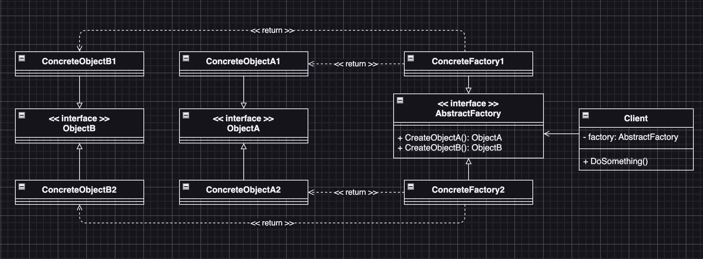

# Abstract Factory (抽象工廠模式)
:label: Creational Pattern

## Abstract Factory Intent (抽象工廠模式定義)
- 是一種創造型的設計模式，它會定義一個介面來建立一組「相關」或「相依」的物件，且不需要指定它們的俱體類別。

## Abstract Factory Structure (抽象工廠模式結構)

## Abstract Factory Participants (抽象工廠模式角色)
* (interface) Objects (圖中的ObjectA & ObjectB)
  - 為一組「相關」或是「相依」的具體物件所定義的介面，也是抽像工廠的各方法的return
* Concrete Objects
  - 繼承Objects介面的實體物件或是類別，這些物件可能是：
    - 「相關」的一系列物件：某個品牌的衣服、鞋子、帽子等…
    - 「相依」的一組物件：汽車的車架、方向盤、車輪
* (interface) AbstractFactory
  - 抽象工廠的介面，這個介面定義了一組創造同一系列Objects介面的方法
* Concrete Factory
  - 實作了「抽象工廠」介面的實體工廠物件
* Client
  - 客戶端，使用抽象工廠的使用者

## Abstract Factory Collaborations (抽象工廠模式角色的互動)
* (interface) Objects
  - 客戶端最終會需要用到的一組物件介面
  - 客戶端通過呼叫AbstractFactory的各種方法來取得Objects
* Concrete Objects
  - Client端程式使用的Objects介面類別背後真正運作的實體類別，但是Client端並不會知道該ConcreteObject究竟是哪一個
* (interface) AbstractFactory 
  - 被客戶端使用的「抽象工廠」介面
  - 客戶端通過這個介面所定義的方法，來取得一系列的Object介面
* ConcreteFactory
  - 實際上真正用來運作「AbstractFactory」的實體類別
  - Client端可以選用不同的ConcreteFactory來創建不同的Concreate Objects
* Client 端程式碼
  - 使用AbstractFactory介面，來取得一系列Objects介面物件

## Abstract Factory Known Uses (抽象工廠模式的適用場景)
* 如果程式碼需要與多個不同系列的相關物件互動，但沒辦法提前知道會和哪些具體類別互動，或是考慮到未來程式的可擴充性，我們不希望程式碼基於物件的具體類別來實作的時候
  - 抽象工廠為我們提供了一個介面，可以用來創建每個系列物件的具體類別
  - 只要程式碼通過這個介面創造介面物件，我們在需要改變所需要的系列物件時，就只需要換掉抽像工廠的具體類別就可以了。
* 如果我們有一個基於「一組」抽象方法的類別，這個類別的責職因為這一組抽象方法變得不明確的時候
  - 單一職責原則告訴我們，一個類別最好只有一個職責
  - 如果一個類別必需同時與多種類型的物件互動，我們就可以考慮將「工廠方法」抽取到獨立的工廠類別 or 具備完整功能的「抽象工廠」類別中

## Abstract Factory Consequences (抽象工廠模式的優點/缺點)
  * 優點
    - 可以確保同一工廠生產的物件是互相關聯的
    - 避免Client端和具體物件的程式碼的耦合
    - 單一職責原則：
      - 我們可以把生產「同一系列」的物件的職責放到工廠物件裡
      - 對於工廠物件來說，就「只有」生產這一系列的物件的責職
    - 開閉原則：
      - 我們需要在原有程式碼中，改變使用到的「一系列」物件時，只需要改變工廠物件即可，最小化修改的幅度。
  * 缺點
    - 由於採用抽象工廠模式需要在程式中加入更多的類別和介面，因此會增加程式的複雜度

## Factory Method Related Patterns (工廠方法模式與其它模式的關係)
* 許多程式設計工作的初期會使用「工廠方法」模式，但隨著需求的增加、或是程式需要用到的物件增加，會可能由「工廠方法」模式，改用「抽象工廠」模式，這樣的設計會會讓程式碼更加的靈活，但是也會變得更加的複雜
* 抽象工廠模式 vs 建造者模式
  - 建造者模式的重點在於「如何漸進地創造複雜的物件」
  - 抽象工廠模式專門拿來生產一系列相關的物件
  - 抽象工廠會馬上return物件
  - 建造者則可以讓我們在產生物件前執行一些額外的建構步驟
* 抽象工廠模式 vs 工廠方法模式 vs 原型模式
  - 抽象工廠模式的基礎通常是一組工廠方法模式
  - 但我們也可以使用原型模來生產這些類別的方法
* 抽象工廠模式 vs 門面模式(facade)
  - 當需要對Client端程式碼封裝子系統建立物件的方式時，我們可以使用抽象工廠模式來代替門面模式
* 抽象工廠模式 vs 橋接模式
  - 我們可以將抽象工廠模式和橋接模式搭配使用
  - 如果由橋接模式定義的介面只能與特定的類別合作，抽象工廠的搭配就會變得非常有用
  - 抽象工廠可以對這些特定的類別進行封裝，並對Client程式碼隱藏產生這些「特定類別」的複雜性
- 抽象工廠模式 vs 建造者模式 vs 原型模式 vs 單例模式
  - 抽象工廠模式、建造者模式、原型模式都可以用單例模式來實現