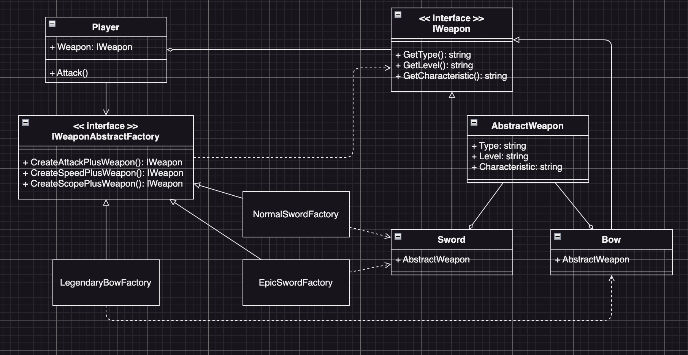

# Abstract Factory Example1 (抽象工廠模式範例1)

## Abstract Factory Motivation (情境)
* 假設你正在設計一個遊戲，遊戲中有不同種類的武器，玩家可以使用這些武器來攻擊怪物：
  - 長劍
  - 弓箭
* 並且這些武器都有不同的等級和特性：
  - 等級：普通、精良、史詩、傳說
  - 特性：+攻擊力、+攻擊速度or+攻擊範圍
- 為了實現這個遊戲，你需要設計一個武器系統，讓系統可以生產出不同種類、等級和屬性的武器。

## Abstract Factory Applicability (解決方案)
* 在這一個案例中，我們可以知道有一個Player物件，並且Player有一個屬性和方法
  - `Weapon`：代表裝備的武器
  - `Attack()`：代表攻擊的類別方法
* 首先我們需要先定義代表武器的介面`IWeapon`，並且有以下的方法
  - `GetType(): string` ：取得武器類別
  - `GetLevel(): string` ：取得武器等級
  - `GetCharacteristic(): string` ：取得武器特性
* 接著我們定義一個抽象工廠`IWeaponAbstractFactory`介面，來讓Clinet端可以透過這個介面來拿到武器
  - `CreateAttackPlusWeapon(): IWeapon` ：建立+攻擊力的武器
  - `CreateSpeedPlusWeapon(): IWeapon` ：建立+攻擊速度的武器
  - `CreateScopePlusWeapon(): IWeapon` ：建立+攻擊範圍的武器
* 然後我們就可以建立幾個具體的工廠，來生產不同等級和類別的武器
  - `NormalSwordFactory`：建立普通劍的工廠
  - `EpicSwordFactory`：建立精良劍的工廠
  - `LegendaryBowFactory`：建立史詩弓箭的工廠
* 定義一個`AbstractWeapon`來存放武器的通用屬性，來給合到實體的武器類別
  - `WeaponType`：武器類別
  - `WeaponLevel`：武器等級
  - `Wharacteristic`：武器特性
* 實作各種武器的實體類別，並繼承實作`IWeapon`介面
* 當玩家在遊戲中需要取得或升級武器時，系統可以根據玩家的需求來呼叫適當的工廠，生產出對應的武器。
  - 如果玩家需要升級自己的劍，系統可以呼叫「精良劍」的工廠來生產出特定等級和屬性的新劍
  - 透過這樣的設計，可以讓遊戲的武器系統更加靈活和易於擴充。

## Factory Method Implementations/Simple Code
值得注意的是，因為我們所需要的只有武器，所以我們在實作上return的都是`IWeapon`介面
* `example1_test.go` 主要測試的程式，看看Client端程式碼如何使用抽象工廠模式
* `weapon.go` 武器的介面與類別
* `weaponfactory.go` 武器工廠的介面與類別