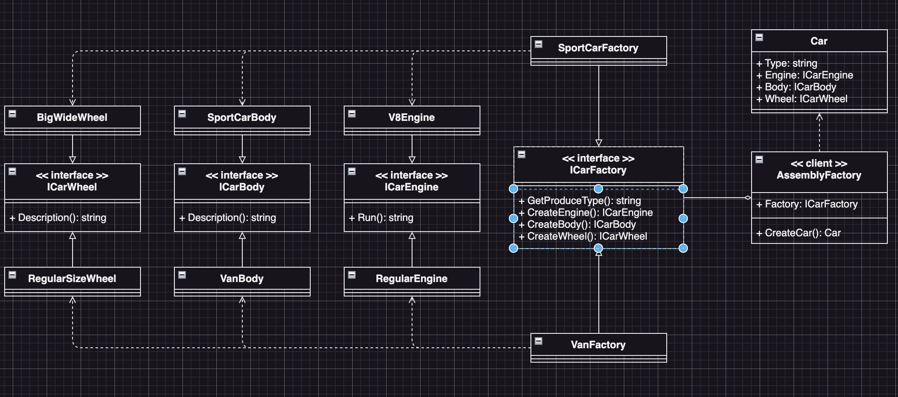

# Abstract Factory Example2 (抽象工廠模式範例2)

## Abstract Factory Motivation (情境)
假設你是一個車廠的設計師，你負責設計不同種類的汽車，其中包括小客車、貨車、跑車等等。而每種汽車又可以有不同的引擎、輪胎、座椅等等部件。為了提高生產效率，我們要設計汽車生產線，讓每種汽車都可以按照特定的設計生產出來。

## Abstract Factory Applicability (解決方案)
* 首先定義一個車子的類別，並含有屬性
  - 引擎
  - 車體
  - 輪胎
* 接著我們定義一個車子工廠的介面，並含有方法
  - 生產引擎
  - 生產車體
  - 生產輪胎
* 最後我們定義三個車子的實體工廠類別，用來生產不同車子的部件
  - 小客車工廠
  - 貨車工廠
  - 跑車工廠
* 最後，Client端是一個零部件組裝的工廠，他會根據不同的車子工廠產出來的部件，組裝成一輛車子

## Abstract Factory Implementations/Simple Code
* `example2_test.go` 主要測試的程式，看看Client端程式碼如何使用抽象工廠模式來生產不同車子的部件們
* `carbody.go` 不同車子的車體介面與類別
* `carengine.go` 不同車子的引擎介面與類別
* `carwheel.go` 不同車子的輪胎介面與類別
* 如果我們要新增一個「大卡車」的車子，我們只需要新增一個大卡車工廠的類別即可