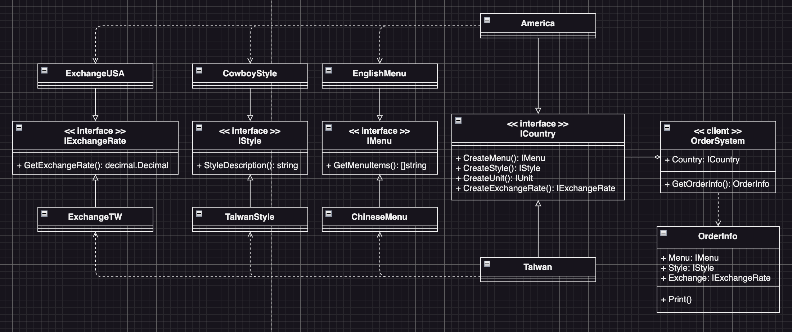

# Abstract Factory Example3 (抽象工廠模式範例3)

## Abstract Factory Motivation (情境)
某個餐廳想要開發一個新的點餐系統，並且要支援多國語言。系統需要提供菜單的顯示、點餐功能以及訂單的編輯、結帳等功能。由於餐廳在不同國家都有分店，每個國家的菜單、口味、匯率等都有所不同。因此，為了適應多國語言和不同的菜單需求，我們需要來實現這個點餐系統。

## Abstract Factory Applicability (解決方案)
設計一個抽象工廠模式的點餐系統，該系統需要支援多國語言，並且要能夠根據不同國家的需求提供不同的菜單、口味、單位和匯率等資訊。請設計抽象工廠、具體工廠、抽象產品和具體產品等相關類別，並編寫測試代碼來驗證系統的功能。
* 首先定義各種所需要產出的產品介面，包括菜單、口味、單位和匯率等資訊
* 以「國家」為分類，定義一個名為「Country」的抽象工廠介面，用來生產不同國家的菜單、口味、單位和匯率等資訊
* 接著實作出兩個具體的國家工廠類別，分別是「台灣」和「美國」
* 最後為每個國家的工廠類別實作出各自的菜單、口味和匯率等資訊類別

## Factory Method Implementations/Simple Code
* `example2_test.go` 主要測試的程式，看看Client端程式碼如何使用抽象工廠模式來生產不同車子的部件們
* `carbody.go` 不同車子的車體介面與類別
* `carengine.go` 不同車子的引擎介面與類別
* `carwheel.go` 不同車子的輪胎介面與類別
* 如果我們要新增一個「大卡車」的車子，我們只需要新增一個大卡車工廠的類別即可