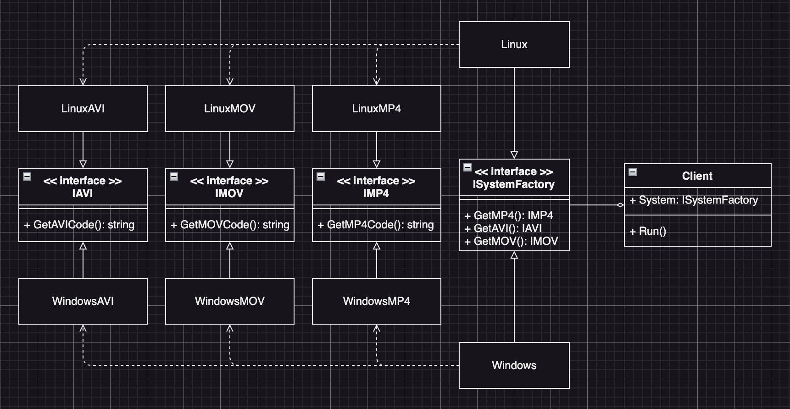

# Abstract Factory Example3 (抽象工廠模式範例3)

## Abstract Factory Motivation (情境)
你正在開發一個多媒體編輯軟體，其中需要支援多種影音格式，包括mp4、avi、mov等。你想使用抽象工廠模式來設計影音格式的解碼器，每個解碼器都能夠將不同格式的影音檔案轉換成統一的內部格式，並且能夠在不同平台上運作。請使用抽象工廠模式來實現這個需求。

## Abstract Factory Applicability (解決方案)
* 假設我們需要兩個系統的解碼器，設計一個抽象工廠介面，用來生產它們的解碼器
  - Linux
  - Windows
* 接著定義各個影音格式的編碥格式介面
    - mp4
    - avi
    - mov
* 最後為每個平台的工廠類別實作出各自的影音格式解碼器

## AbstractFactory Implementations/Simple Code
* `client.go` 主要測試的程式
* `interfaces.go` 各種會用到的介面
* `windows.go` windows系列的實作
* `linux.go` linux系列的實作