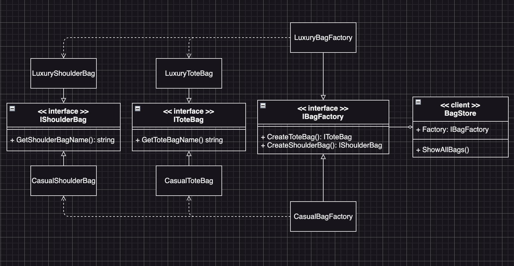

# Abstract Factory Example5 (抽象工廠模式範例5)

## Abstract Factory Motivation (情境)
當代設計師John決定開設一家提供多種手提包設計的手袋店，他打算用抽象工廠模式來實現，以方便隨時增加新的手提包種類。為了確保每種手提包的質量和風格都一致，他需要實現一個工廠接口，讓不同的工廠實現該接口，並按照統一的內部格式製造不同款式的手提包。

## Abstract Factory Applicability (解決方案)
* John首先建立了一個抽象的BagFactory接口，其中定義了製造不同款式手提包的方法：
  - createToteBag()
  - createShoulderBag()
* 然後他創建了兩個工廠類型，分別是：
  - LuxuryBagFactory
  - CasualBagFactory
* 這兩個工廠類別分別實現BagFactory接口，並分別製造名為Tote Bag和Shoulder Bag的手提包
* 每個工廠都有自己的設計風格和質量標準，但在創建手提包時，它們都必須遵循統一的內部格式，以確保所有手提包都符合John的品牌形象和要求。

## AbstractFactory Implementations/Simple Code
* `bagstore.go` 主要測試的程式
* `interfaces.go` 各種會用到的介面
* `luxury.go` luxury系列的實作
* `casoul.go` casoul系列的實作