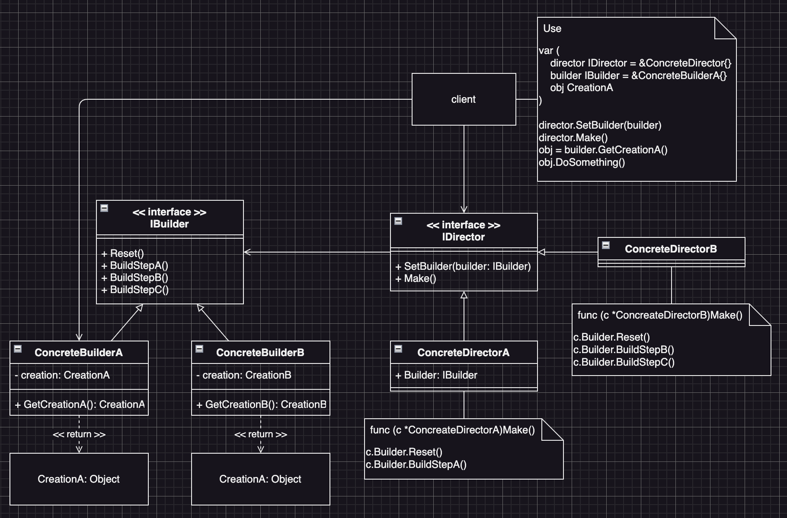

# Builder (建造者模式)
:label: Creational Pattern

## Builder Intent (建造者模式定義)
- 是一種創造型的設計模式
- 封裝物件的建立，並能讓我們能夠分步驟創造複雜的物件
- 這個模式允許我們使用相同的程式碼，來產生不同類型和形式的物件

## Builder Structure (建造者模式結構)

## Builder Participants (建造者模式角色)
* (Interface) IBuilder
  - 定義物件建立的各個步驟
* (Class) ConcreteBuilder
  - 實作IBuilder介面，並定義物件建立的各個步驟
  - 每個不同的步驟可分別對各自的Creation產生單獨的影響
  - 最後Client端可透過GetCreation()來取得各自的Creation物綿
  - 圖中`ConcreteBuilderA`跟`ConcreteBuilderB`的標的物`CreationA`與`CreationB`是不同物件
    - 也就是說兩個Builder的產出是不同的物件
    - 當然也可以透過介面來產出具有相同介面的不同物件
    - 可不可以產出相同的物件但是藉由實作不同的步驟來設定各別的屬性？
      - 思考過後覺得不好，因為這樣會讓Client端混淆：不同的Builder需要產出同一個物件，但是最終拿到的物件卻不一樣
* (Object) Creation
  - 被Client端使用的物件
  - Creation的產出過程：
    - 一開始Creation會被交到Builder的手中
    - Builder可以透過各種步驟方法來改變Creation的各種屬性
    - 在Director的指揮下，Builder的各種步驟方法會被Director呼叫
    - 最後由Client端向Builder取得最終的Creation物件
* (Interface) IDirector
  - IDirector的介面定義了兩個方法：
    - `SetBuilder()` 設定Director要指揮的Builder
    - `Make()` 指揮Builder要建構的順序都寫在這裡
* (Class) ConcreteDirector
  - 實作IDirector介面
  - 這裡是實際上指揮Builder該如何或是按何種順序建構Object的地方
* (Client) 程式Client
  - 建造者模式的使用者

## Builder Collaborations (建造者模式角色的互動)
* (Interface) IBuilder
  - Director使用IBuilder介面在把Director的實作與Builder物件解耦
* (Class) ConcreteBuilder
  - Client端使用ConcreteBuilder來組合Director
* (Object) Creation
  - 最終會被Client使用的物件
  - 一開始會存在於Builder裡面
  - 直到Director指揮完Builder對該物件的建構後，Client才會透過Builder將該物件取出來使用
* (Interface) IDirector
  - Client使用的IDirector來把程式實作與Director物件解耦
* (Class) ConcreteDirector
  - Client實例化ConcreteDirector並帶入IDirector裡面
  - 接著Client會把Builder指派給Director
* (Client) 程式Client
  - 先選好要用哪一個Director物件
  - 再選擇要用哪一個Builder物件
  - 接著透過Director.`SetBuilder()`方法把Builder帶進Director物件裡面
  - 然後使用Director.`Make()`方法去讓Builder把物件建構好
  - 最後使用Builder.`GetCreation`來取得最終要使用的物件

## Builder Known Uses (建造者模式的適用場景)
* 避免「重疉建構式(Telescoping Constructor)」的出現時
  - 如果某物件建構時要帶入非常多的可選/不可選參數時，那麼我們在實例化該物件會非常不方便
  - 這個時候我們就可以實作幾個`Director`來透過Builder把該物件建構成我們常用的樣子
  - 但是並不代表我們就不用在Builder裡面去設定「必選」預設值
  - Builder模式通常拿來改變那些可選的物件屬性
  - 我們使用Builder模式來簡化使用該物件的前置作業
* 當我們希望使用程式碼來創建不同形式的物件時
  - 例如：石頭房子、木頭房子、鐵房子
  - 如果我們需要創建的各種形式的物件，它們的「建構過程相似」但是「細節上」有些差異時，我們就可以使用Builder模式
  - builder的介面中定義了所有可能的製造步驟，具體builder將實現這些步驟來製造特定形式的物件
  - 同時Director類別將負責管理製造步驟的順序
* 使用Builder來建構組合樹或其它複雜物件時
  - Builder模式讓我們可以分步驟建構物件
  - 我們可以延遲執行某些步驟，而不會影響最終的物件
  - 我們甚至可以遞迴來呼叫這些步驟，這在建構物件樹時非常方便。
  - Builder在執行製造步驟時，不會對外發布未完成的物件，這可以避免Client端程式碼取得到不完整的結果物件。

## Builder Consequences (建造者模式的優點/缺點)
  * 優點
    - 我們可以分步創建物件，暫緩創建步驟或是遞迴呼叫創建步驟
    - 生產不同形式的物件時，我們可以重複使用相同的製造程式碼
    - 單一職責原則(SRP)：Builder模式可以將複雜的建構程式碼從產品的業務邏輯中分離出來
  * 缺點
    - 由於Builder模式需要建立很多的Builder類別，所以程式碼會變得複雜

## Builder Related Patterns (建造者模式與其它模式的關係)
* 建造者模式 vs 工廠方法模式
  - 在許多設計工作的初期都會先使用工廠方法模式
  - 而在後期會隨著工作愈加複雜，會演化為使用
    - 「抽象工廠模式」
    - 「原型模式」
    - 「建造者模式」
* 建造者模式 vs 抽象工廠模式
  - 抽象工廠模式是用來建立一系列相關或相依的物件
  - 建造者模式則是依步驟來建立複雜的物件
  - 抽象工廠會馬上return所要建立的物件
  - Builder則是需要先透過Director來依循特定的步驟建立物件之後，Client端才能從Builder取得該物件
* 建造者模式 vs 組合模式
  - 我們可以在建立複雜的組合模式時使用Builder模式
  - 這可使組合模式的建構以遞迴的方式進行
* 建造者模式 vs 橋接模式
  - 我們可以結合使用建造者模式與橋接模式
    - Director來負責抽象工作
    - 各種不同的Builder來負慣實現工作
* 建造者模式 vs 抽象工廠模式 vs 原型模式 vs 單例模式
  - 建造者模式、抽象工廠模式與原型模式都可以用單例模式來實現