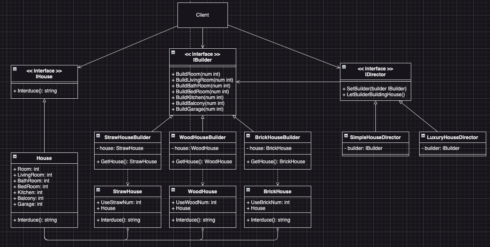

# Builder Example1 (建造者模式範例1)

## Builder Motivation (情境)
假設有一個複雜的物件，在對它進行建構時需要對許多成員變數和巢狀物件進行繁複的初始化工作。這些初始化程式碼通常深藏於一個包含許多參數且讓人基本看不懂的建構函式中；甚至還有更糟糕的情況，那就是這些程式碼散落在客戶端程式碼的多個位置，例如：
* 我們來思考如何來創建一個房屋`House`物件
* 建當一棟簡單的房屋時，我們需要：
  - 建造四面牆和地板
  - 安裝房門和一套窗戶
  - 建造一個屋頂
* 如果我們想要一棟更寬敞更明亮的房屋，還要有院子和其他設施（例如暖氣、排水和供電設備），那又該怎麼辦呢？
  - 最簡單的方法是擴展`House`類別，然後創建一系列涵蓋所有參數組合的子類別：
    - 最終子類別的數量將變得無比龐大，任何新增的參數（例如門廊類型）都會讓這個層次結構更加複雜。
  - 另一種方法則不需要增加子類別的數量
    - 我們可以為`House`類別中建立一個包含所有可能參數的超級建構函式，並用它來控制`House`物件的建立
    - 但是會碰上一個情況：Client端程式碼在建立`House`物件時必需要帶入一大堆的參數，這樣就會造成程式碼的可讀性變差，而且也不好維護。
    - 在一般情況下，使用`House`物件的程式碼只會用到少數幾個參數
      - like:只有很少的房子有游泳池，因此與游泳池相關的參數十之八九是毫無用處的。

## Builder Applicability (解決方案)
我們可以利用Builder模式來建立`House`物件：Builder會將`House`物件的建立過程分成多個步驟，並且交由Director來決定來建造什麼樣子的`House`物件。
* 首先我們先來定義`IBuilder`介面，來說明一個Builder應該要會蓋哪些東西
  - `BuildRoom(num int)` 建立房間
  - `BuildLivingRoom(num int)` 建立客廳
  - `BuildBathRoom(num int)` 建立浴室
  - `BuildBedRoom(num int)` 建立臥室
  - `BuildKitchen(num int)` 建立廚房
  - `BuildBalcony(num int)` 建立陽台
  - `BuildGarage(num int)` 建立車庫
* 接著我們可以實作各種不同的`Builder`，來讓不同的Builder用不同的材質來蓋房子
  - `StrawHouseBuilder` 用稻草來蓋房子的Builder
  - `WoodHouseBuilder` 用木頭來蓋房子的Builder
  - `BrickHouseBuilder` 用磚頭來蓋房子的Builder
* 然後我們來定義`IDirector`，也就是工頭，不同的工頭會告訴Builder要蓋什麼樣的房子
  - `SetBuilder(builder IBuilder)` 設定Director要指揮哪一個Builder來蓋房子
  - `LetBuilderBuildingHouse()` 指揮Builder蓋房子
* 接著實作`IDirector`，不同的Director會蓋出不同的房子
  - `SimpleHouseDirector` 蓋簡單房子的工頭，能夠蓋出一間兩房一廰一衛的房子
  - `LuxuryHouseDirector` 蓋豪華房子的工頭，能夠蓋出一間四房二廰二衛一廚房的房子，還帶一個車位
* 經過工頭指揮Builder蓋房子後，我們就可以從Builder那裡得到一棟蓋好的房子了

## Builder Implementations/Simple Code
* `house.go` house介面及實作
* `builder.go` builder介面及實作
* `director.go` director介面及實作
* 測試：`go test -v .`