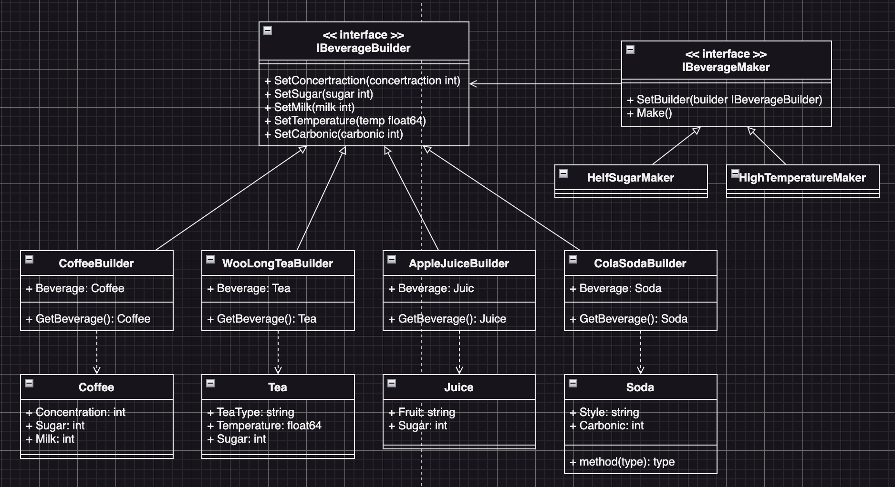

# Builder Example2 (建造者模式範例1)

## Builder Motivation (情境)
當今有許多種飲料，例如咖啡、茶、果汁、汽水等等，每種飲料都有它獨特的味道和製作方式，而現在我們希望設計一個飲料店的點餐系統，可以讓客戶點不同種類的飲料。

* 每個飲料都有它的屬性，例如：
  - 咖啡有濃度、甜度、加奶/加糖等選項
  - 茶有茶種、溫度、甜度等選項
  - 果汁有果種、甜度等選項
  - 汽水有口味、碳酸度等選項。
* 而每個選項的預設值都不同，例如：
  - 甜度在咖啡中的預設值可能是中糖，而在果汁中的預設值可能是不加糖。

## Builder Applicability (解決方案)
* 使用建造者模式，我們可以定義一個「飲料建造者(DrinkBuilder)」介面：
  - 該介面中定義了一系列用於設置不同屬性的方法，例如setMilk、setSugar、setFlavor等等。
* 接著我們可以實作不同飲料的建造者類別，例如：
  - CoffeeBuilder
  - TeaBuilder
  - JuiceBuilder
  - SodaBuilder
  - 每個類別實現了飲料建造者介面中的方法，並定義了該類飲料的預設屬性值。
* 我們可以建立一個「訂單建造者(OrderBuilder)」類別
  - 該類別包含一個用於建立訂單的buildOrder方法，該方法可以根據客戶點的飲料種類、數量以及額外選項，建立一個包含多個飲料的訂單(Order)物件。
  - 在訂單建造者類別中，我們可以使用不同的飲料建造者來建立不同種類的飲料，並將這些飲料加入訂單中，最後返回建立完成的訂單物件。
  - 這樣我們就可以統一不同種類的飲料建造過程，並且能夠方便地增加新的飲料種類。

## Builder Implementations/Simple Code
* `house.go` house介面及實作
* `builder.go` builder介面及實作
* `director.go` director介面及實作
* 測試：`go test -v .`