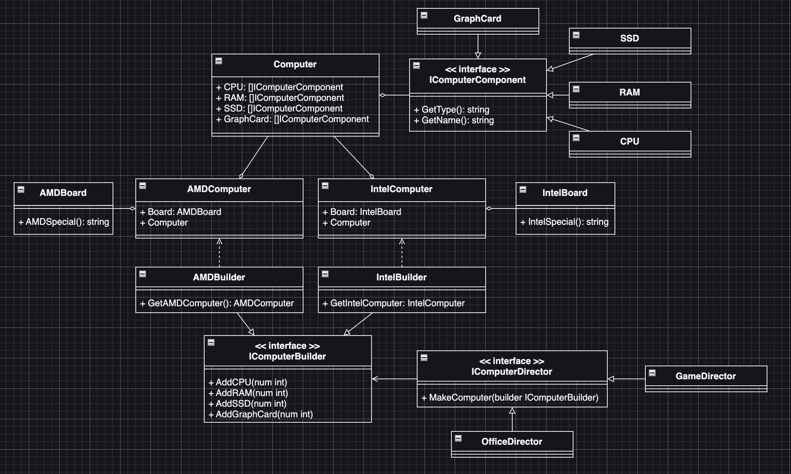

# Builder Example3 (建造者模式範例3)

## Builder Motivation (情境)
我們是一家光華商場的電腦商店，我們從不同的供應商那裡拿到電腦組件，組裝完成後出售給顧客，為了把賣不出去的組件便宜出售，我們決定開始賣套裝電腦：
* 套裝電腦可分為：
  - 文書機：不需要顯卡，RAM也只需要一絛
  - 電競機：我們可以裝兩張顯卡，還有4條Ram
* 並且組件的供應商大體上也分為兩大類：
  - Intel系列
  - AMD系列
請用建造者模式設計一個系統，可以讓顧客來選擇不同系列的套裝電腦

## Builder Applicability (解決方案)
* 我們先定義一個電腦類別，包含了電腦的屬性：
  - CPU
  - RAM
  - GPU
  - HD
* 我們先定義兩個電腦類別，分別是AMD平台與Intel平台：
  - IntelComputer
  - AMDComputer
* 我們定義一個建造者類別，可以設定該裝幾張顯卡，幾條RAM等等
  - IComputerBuilder
* 然後定義兩個建造者類別，分別是Intel與AMD的建造者，並實作IComputerBuilder介面
  - IntelBuilder
  - AMDBuilder
* 定義一個指揮者介面，可以指揮建造者來建造電腦
  - IComputerDirector
* 最後定義兩個指揮者類別，分別是文書機指揮者跟電競機指揮者，並實作IComputerDirector介面
  - OfficeDirector
  - GameDirector
* 結果就是，我們可以指定一個平台的建造者去給指揮者，來得到不同的電腦

## Builder Implementations/Simple Code
* `house.go` house介面及實作
* `builder.go` builder介面及實作
* `director.go` director介面及實作
* 測試：`go test -v .`

