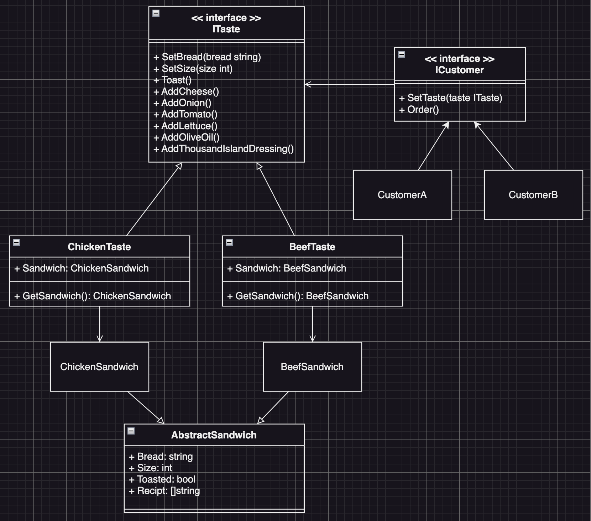

# Builder Example4 (建造者模式範例4)

## Builder Motivation (情境)
我們是一間連鎖的潛艇堡專賣店，我們最大的特點是：基於特定的口味的基礎之上，來讓顧客自已選擇潛艇堡的材料來組成潛艇堡
* 目前我們有兩種口味：
  - 雞肉潛艇堡
  - 牛肉潛艇堡
* 並且我們可以讓客人自由選擇的材料與做法有：
  - 麵包
  - 潛艇堡尺寸
  - 麵包加熱
  - 加起司
  - 加洋蔥
  - 加番茄
  - 加生菜
  - 加橄欖油
  - 加千島醬
設計一個點餐系統，讓客人可以自訂潛艇堡

## Builder Applicability (解決方案)
我們把每個不同的客人都當作一個Director，而不同的口味就是不同的Builder，這樣一來，就可以透過Director的Order方法來客製潛艇堡：
* 定義一個`ICustomer`介面來當作`Director`，這個介面能夠選擇口味`ITaste`，並且下訂單
  - SetTaste(taste ITaste)
  - Order()
* 接著定義一個`ITaste`來當作`Builder`，並且這個介面有各種潛艇堡的可客製選項方法
  - `SetBread(bread string)`
  - `SetSize(size int)`
  - `Toast()`
  - `AddCheese()`
  - `AddOnion()`
  - `AddTomato()`  
  - `AddLettuce()`
  - `AddOliveOil()`
  - `AddThousandIslandDressing()`
* 接著我們就可以分別實作`ChickenTaste`與`BeefTaste`來當作`Builder`
* 最後實作各種Customer來當作`Director`，並且透過`Order()`來下訂單
  - 我們可以在Order方法裡面來決定潛艇堡該如何客製

## Builder Implementations/Simple Code
* `customer.go` 客人Director相關的介面和實作
* `teste.go` 口味Builder的介面和實作
* `sandwich.go` 潛艇堡的實作
* 測試：`go test -v .`

