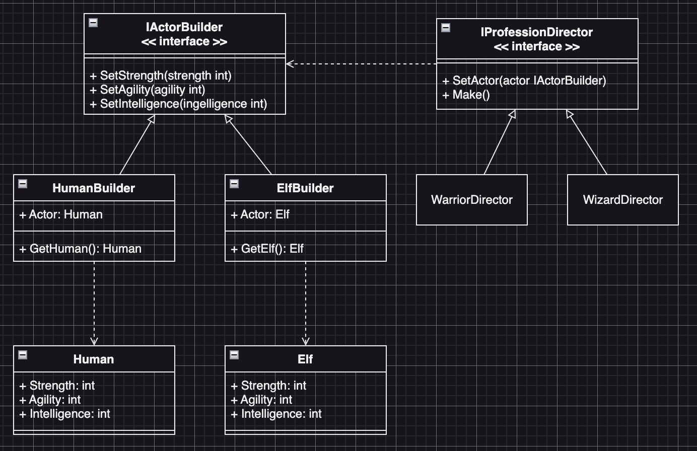

# Builder Example5 (建造者模式範例5)

## Builder Motivation (情境)
假設您正在開發一個遊戲：
  - 這個遊戲有兩個種族：人類和精靈。
  - 每個角色擁有不同的屬性，例如：力量、敏捷、智力等。
  - 我們可以選擇種族之後來創建職業Like：戰士、法師、弓箭手等。
  - 對不同職業的區分方法，只有屬性上的差異，例如：戰士的力量和敏捷較高，法師的智力較高，弓箭手的敏捷較高等。
我們需要一個有效率的方式，來創建不同的種族和職業角色。

## Builder Applicability (解決方案)
* 定義一個`IActorBuilder`介面，這個介面有各種Setter方法來設定屬性，Like：
  - `SetStrength(strength int)`
  - `SetAgility(agility int)`
  - `SetIntelligence(intelligence int)`
* 定義一個`Director`介面`IProfessionDirector`，這個介面能夠選擇種族`SetActor()`，並且透過`Make()`方法來將不同的種族角色朔造成相關的職業
* 定義兩個類別`Human`跟`Elf`來代表人類與精靈
* 定義兩個Builder類別：`HumanBuilder`跟`ElfBuilder`，並為這兩個類別實作`IActorBuilder`介面
* 定義兩個Director類別：`WarriorDirector`跟`WizardDirector`，並為這兩個類別實作`IProfessionDirector`介面
* 最後Client就可以使用Builder來選擇種族，並且用Director來選擇職業

## Builder Implementations/Simple Code
* `customer.go` 客人Director相關的介面和實作
* `teste.go` 口味Builder的介面和實作
* `sandwich.go` 潛艇堡的實作
* 測試：`go test -v .`

