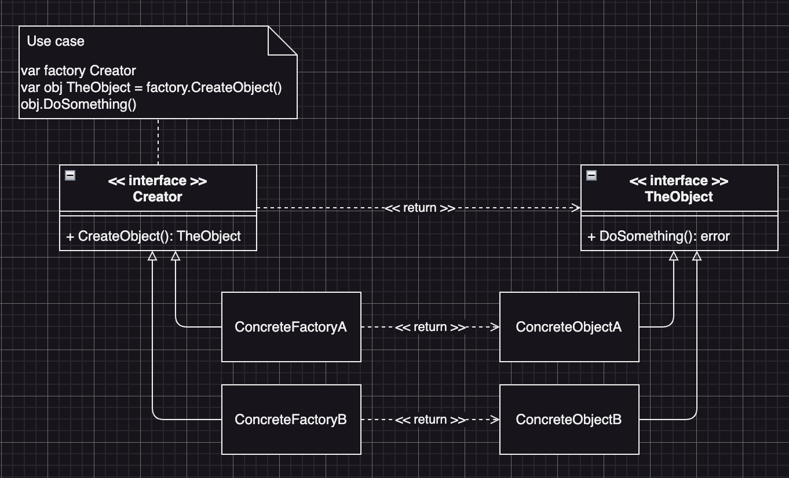

# Factory Method (工廠方法模式)
:label: Creational Pattern

## Factory Method Intent (工廠方法模式定義)
- 一種創造性的模式，定義了一個創造物件的介面(interface)，並且該介面定義了一個創造物件的方法，讓繼承並實作該介面的類別來決定要創造什麼樣的物件或實例化哪一個類別
- 工廠方法可以讓一個類別將實例化的工作推遲到繼承該介面的子類別

## Factory Method Structure (工廠方法模式結構)

## Factory Method Participants (工廠方法模式角色)
* (interface) TheObject
  - 定義工廠方法產出的物件介面，才可以讓不同的工廠產出具有相同介面的類別實作
* ConcreteObject
  - 繼承「TheObject」的各別實體物件們
* (interface) Creator 
  - 定義return「TheBoject」介面物件的工廠方法，這個方法return的物件必需實作「TheObject」介面
  - 我們可以把工廠方法定義為抽象方法，強制要求每個子類別以不同的方法實現這個抽象方法
  - 或者，我們也可以在基礎工廠方法中return預設的「TheObject」物件
* ConcreteFactory
  - 繼承了「Creator」介面的物件，這些物件會覆寫基礎工廠的方法，使該方法return具有相同介面的不同類別
  - 並不一定每次使用工廠方法會創建新的物件，工廠方法也可以return「Cache」、「物件池」或是其它來源的已存在物件

## Factory Method Collaborations (工廠方法模式角色的互動)
* (interface) TheObject
  - Client端程式會使用到的介面類別
* ConcreteObject
  - Client端程式使用的介面類別背後真正運作的實體類別，但是Client端並不會知道該ConcreteObject究竟是哪一個
* (interface) Creator 
  - Client端程式拿來生產「TheObject」的工廠方法物件
  - Client端程式透過Creator來生產所需要用到的「TheObject」物件
* ConcreteFactory
  - 實際上真正用來運作「Creator」的實體類別
  - Client端可以選用不同的ConcreteFactory來創建不同的「TheObject」物件

## Factory Method Known Uses (工廠方法的適用場景)
* ### 在Coding的「過程」中，如果當下還沒有辦法知道程式要用到的「切確類別」及其依賴關係時：
  - 工廠方法將**創建物件「TheObject」的程式**與**實際使用「TheObject」的程式**分離，進而在不影響其它程式的情況下，擴充**創造「TheObject**的程式
  - 如果我們需要一個新的「TheObject」:「ConcreteObjectC」的時候，我們只需要新增一個實作「Creator」介面的工廠物件即可
* ### 如果我們要讓使用端來擴充「package or 框架」的內部組件時：
  - 繼承可能是擴展「軟體 or 框架」預設行為最簡單的方法，但是當我們使用子類別替代標準組件時，框架該如何分辦出該子類別？
    - 將各框架中的構造組件程式碼集中到單個工廠方法中，除了繼承該組件之外，可以允許任何人對該方法進行覆寫
  - 假設我們使用一個Open Source UI 框架編寫自已的應用程式，我們希望在程式中使用圓形的按鈕，但是原來的框架只支援方形按鈕：
    - 我們可以使用圓形按鈕的類別來繼承**按鈕類別**，但是我們需要告訴UI框架類別使用新的按鈕類別來代替預設按鈕
    - 為了實現這個功能，我們可以根據基礎框架類別開發子類別：**圓形按鈕**，並且覆寫框架子類別的CreateButton創建按鈕方法。
    - 基礎類別的CreateButton方法return「按鈕Interface」，而我們開發的框架子類別就可以return**圓形按鈕**
    - 接著我們就可以使用圓形按鈕UI類別來代替UI框架類別
* ### 如果我們希望重複利用現有物件來節省系統資源，而不是每次都要重新創建物件時：
  - 在處理大型資源密集物件，比如：Database連接、文件系統or網路資源時，我們會經常碰到這種資源需求
  - 所以要從「重複使用現有物件」的角度去思考
    * 我們需要創建儲存空間來存放所有已經創建的物件
    * 當外部使用者呼叫請求一個物件時，程式將在物件池中尋找可用的物件，然後將這個可用物件return給外部使用者
    * 如果物件池中沒有可供使用的物件，程式則要創建一個新物件，並把這個新物件放到物件池中
    * 這些程式碼需要位在同一個地方，確保重複的程式碼不會污染程式
    * 最直接的方式，就是將這些程式碼放置在我們試重複使用物件類別的建構式中，但是從定義上來說，建構式始終return的是新物件，無法return現有的實例
    * 因此，我們需要一個「既能創建新物件，又可以重複利用現有物件」的普通方法，這看起來非常像工廠方法

## Factory Method Consequences (工廠方法的優點/缺點)
  * 優點
    - 將「Creator」與「Concrete Object」解耦
    - 符合單一職責原則：我們可以將「TheObject」的創造程式碼放在單一的物件類別裡面，使程式碼的維護更加方便
    - 符合開閉原則：無需更改現有的Client端程式碼，我們就可以在程式中額蚾增加「TheObject」類別
  * 缺點
    - 工廠方法模式會需要創造許多的子類別，程式碼無疑會因此變得複雜
    - 最好的情況是將工廠方法模式引入「Creator」類別現有的層次結構當中

## Factory Method Related Patterns (工廠方法模式與其它模式的關係)
* 許多設計工作的初期都會使用工廠方法模式
  - 因為比較簡單，且可以更方便的通過子類別進行變動或更改
  - 之後可能會演化成使用：
    - 「抽象工廠模式」
    - 「原型模式」
    - 「建造者模式」
* 抽象工廠模式通常以一組工廠方法模式為基礎，但我們也可以使用原基模式來生產這些別的方法
* 我們可以同時使用工廠方法模式和迭代器模式，來讓子類別集合return不同類型的迭代器，並使迭代器與集合相符合
* 原基並不基於繼承，因此沒有繼承的缺點
  - 原型需要對被複製的物件進行複雜的初始化
  - 工廠方法基於繼承，但是工廠方法「不需要」初始化步驟
* 工廠方法模式是樣版方法模式的一種變體，
  - 工廠方法也可以作為一個大型模板方法中的一個步驟