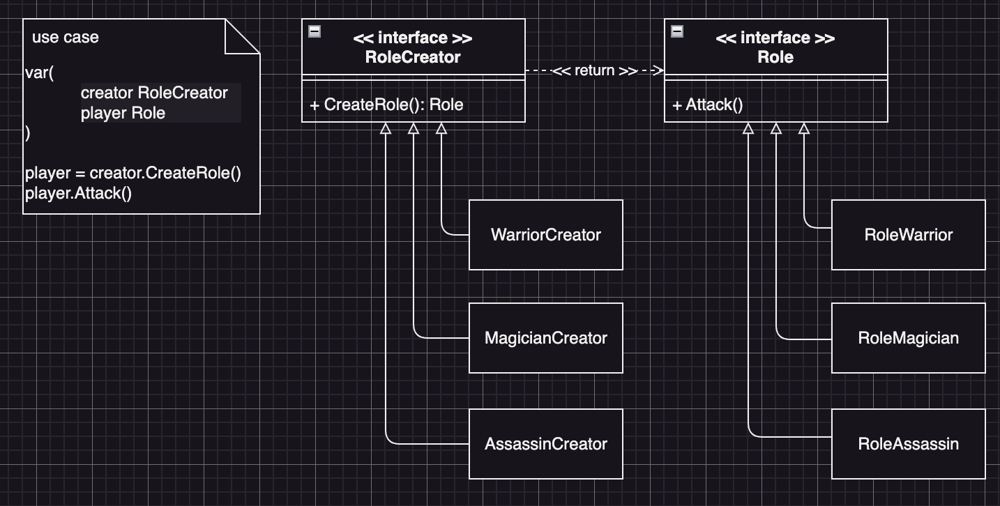

# Factory Method Example1 (工廠方法模式範例1)

## Factory Method Motivation (情境)
遊戲開發公司需要開發一款角色扮演遊戲，其中有多種職業，包括戰士、法師、刺客等，每個職業都有自己獨特的能力和武器，並且未來還有可能新增其它的職業，我們需要幾個角色產生器，讓它可以根據玩家的選擇產生對應的角色，在這個角色扮演遊戲中，玩家需要先選擇自己喜歡的職業，然後才能開始遊戲每個職業都有自己獨特的能力和武器：
- 戰士可以使用長劍和盾版進行近戰攻擊
- 法師可以使用魔杖和魔法進行遠程攻擊
- 刺客可以使用匕首和穩身進行偷襲攻擊

## Factory Method Applicability (解決方案)
- 首先我們定義一個角色的介面，在這個介面裡面有一個方法「攻擊」，**Client端使用這個角色介面物件，來進行遊戲**。
- 接著定義一個角色產生器的介面，Client端可以透過這個產生器來拿到角色介面物件，**Client端程式碼並不需要知道實際拿到了哪一個職業實例，只需要知道這個角色有一個攻擊的方法**
- 接著實作每個角色的類別，並確保這些類別都實作了「職業介面」
- 然後為這些角色製做專屬於它們的工廠，**並確保這些工廠類別實作了「角色產生器」的介面**

## Factory Method Implementations/Simple Code
* role.go
  - 角色介面與實作
* rolecreator.go
  - 角色產生器介面與實作
* 測試
  - `go test -v .`