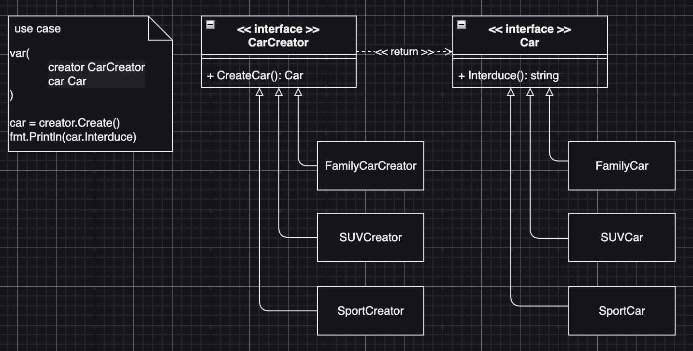

# Factory Method Example2 (工廠方法模式範例2)

## Factory Method Motivation (情境)
一家汽車製造公司需要生產多種車型，包括轎車、越野車、跑車等，每種車型都有不同的引擎和底盤，我們需要幾個汽車製造工廠，讓它可以根據不同的需求生產對應的汽車，在這家汽車製造公司中，有多種車型可以供消費者選擇，例如轎車、越野車和跑車等。每種車型都有不同的特點：
- 轎車適合城市行駛
- 越野車適合崎嶇的山路
- 跑車則適合高速公路上的競速

## Factory Method Applicability (解決方案)
- 首先我們定義一個汽車的介面，在這個介面裡面有一個方法「介紹」來讓客戶知道每種車子的特點，**Client端使用這個汽車介面物件，來了解車型**。
- 接著定義一個汽車產生器的介面，Client端可以透過這個產生器來拿到汽車介面物件，**Client端程式碼並不需要知道實際拿到了哪一個汽車實例，只需要知道這個汽車有一個介紹的方法**
- 接著實作每個汽車的類別，並確保這些類別都實作了「汽車介面」
- 然後為這些汽車製做專屬於它們的工廠，**並確保這些工廠類別實作了「汽車產生器」的介面**

## Factory Method Implementations/Simple Code
* car.go
  - 汽車介面與實作
* carcreator.go
  - 汽車產生器介面與實作
* 測試
  - `go test -v .`