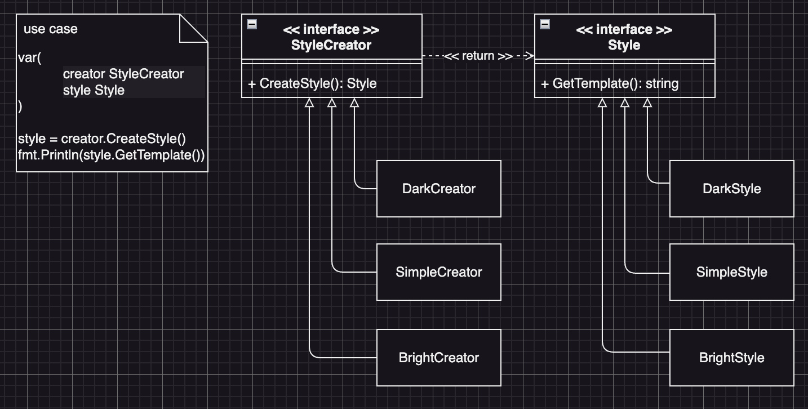

# Factory Method Example3 (工廠方法模式範例3)

## Factory Method Motivation (情境)
一家電子產品公司需要開發一款智能手機應用程式，其中有多種主題和風格，例如黑暗風格、簡約風格、色彩豐富風格等，設計這個手機應用程式，讓它可以根據不同的主題和風格來生成對應的界面，這款智能手機應用程式需要有多種主題和風格，讓使用者可以根據自己的喜好來選擇：
- 黑暗風格可以使手機屏幕顯示更加柔和的顏色
- 簡約風格可以使界面更加整潔美觀
- 色彩豐富風格可以使手機屏幕變得更加鮮豔多彩

## Factory Method Applicability (解決方案)
- 首先我們定義一個「樣式介面」，在這個介面裡面有一個方法「產生模板」，來讓Client端取得風格的模板**Client端使用這個模板介面物件，呈現不同風格的使用者介面**。
- 接著定義一個風格產生器的介面，Client端可以透過這個產生器來拿到「樣式介面」物件，**Client端程式碼並不需要知道實際拿到了哪一個樣式實例，只需要知道使用這個「樣式介面」就可以拿到一個風格模板**
- 接著實作每個風格的類別，並確保這些類別都實作了「樣式介面」
- 然後為這些風格製做專屬於它們的工廠，**並確保這些工廠類別實作了「風格產生器」的介面**

## Factory Method Implementations/Simple Code
* style.go
  - 樣式介面與實作
* stylecreator.go
  - 樣式產生器介面與實作
* 測試
  - `go test -v .`

