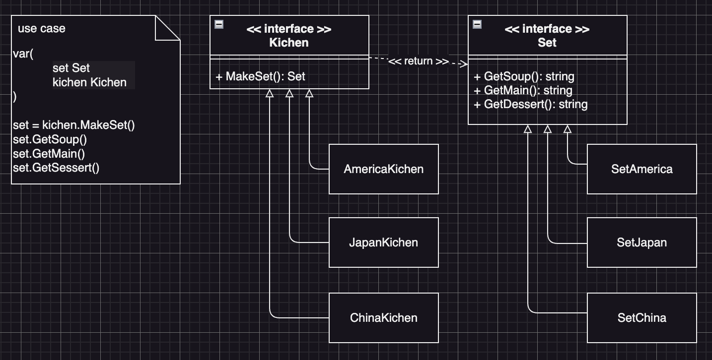

# Factory Method Example4 (工廠方法模式範例4)

## Factory Method Motivation (情境)
一家餐廳需要設計一個菜單，其中有多種菜式，包括湯品、主菜、甜點等，每種菜式都有不同的食材和烹飪方式，請使設計這個菜單，讓它可以根據不同的菜式生產對應的菜品，在這家餐廳中，有多種菜式可以供顧客點選，例如湯品、主菜、甜點等，每種菜式都有不同的口味和風格：
- 湯品可以是酸辣口味，主菜可以是川菜風格
- 甜點可以是法式甜點風格
為了實現這個功能餐廳可以使用工廠方法模式，根據不同的菜式，使用對應的工廠來生產對應的菜品物件。

## Factory Method Applicability (解決方案)
- 顧客使用者最終需要的是拿到菜式，因此我們定義一個「菜式」介面，這個介面提供三個方法，並分別代表：
  - GetSoup(): string 湯品
  - GetMain(): string 主菜
  - GetDesert(): string 甜點
- 然後我們定義一個「菜式產生器」的介面，讓廚房拿來產生菜式
- 接著實作每一個菜式類別，並確保這些類別都實作了「菜式」介面
  - 美式：玉米濃湯、牛排、甜甜圈
  - 日式：味增湯，壽司、麻糬丸子
  - 中式：酸辣湯、牛肉麵、包子
- 最後實作每一個菜式產生器，並確保這些類別都實作了「菜式產生器」介面

## Factory Method Implementations/Simple Code
* set.go
  - 菜式的介面與實作
* kichen.go
  - 菜式產生器介面與實作
* 測試
  - `go test -v .`

