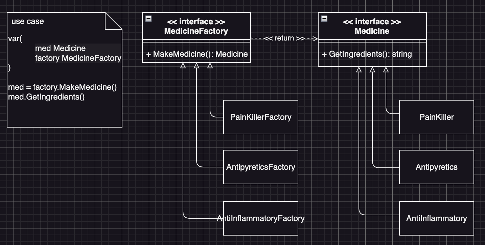

# Factory Method Example5 (工廠方法模式範例5)

## Factory Method Motivation (情境)
一家製藥公司需要開發多種藥品，包括止痛藥、退燒藥、消炎藥等，每種藥品都有不同的成分和劑量，請使用工廠方法模式來設計這個製藥工廠，讓它可以根據不同的需求生產對應的藥品，在這家製藥公司中，有多種藥品可以供患者使用，例如止痛藥、退燒藥、消炎藥等。每種藥品都有不同的成分和劑量：
- 止痛藥可以包含阿司匹林成分
- 退燒藥可以包含布洛芬成分
- 消炎藥可以包含青黴素成分等
為了實現這個功能，製藥公司可以使用工廠方法模式，根據不同的需求，使用對應的工廠來生產對應的藥品物件。這樣就可以讓製藥公司更加靈活地根據市場需求來生產不同的藥品，提高市場競爭力。

## Factory Method Applicability (解決方案)
- 病患使用者最終需要的是拿到藥品，因此我們定義一個「藥品」介面，這個介面提供一個方法：
  - GetIngredients() string 取得成份
- 然後我們定義一個「藥品工場」的介面，來生產藥品介面的物件
- 接著實作每一個藥品類別，並確保這些類別都實作了「藥品」介面
- 最後實作每一個藥品的工廠類別，並確保這些類別都實作了「藥品工廠」介面

## Factory Method Implementations/Simple Code
* medicine.go
  - 藥品的介面與實作
* medicinefactory.go
  - 藥品工廠介面與實作
* 測試
  - `go test -v .`

