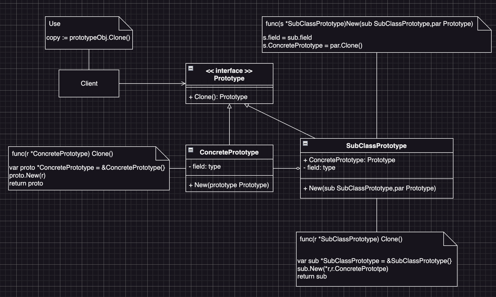

# Prototype (原型模式)
:label: Creational Pattern

## Prototype Intent (原型模式定義)
- 是一種創造型的設計模式
- 讓許我們通過複製現有物件來創建新物件，而無需依賴顯式的建構過程。
- 這種模式適用於「創建一個新物件的過程比較昂貴或複雜時」，可以節省時間和資源。

## Prototype Structure (原型模式結構)

## Prototype Participants (原型模式角色)
* (interface) Prototype
  - 定義了複製自己的介面
  - 在大多數的情況下，它只會有一個方法：`Clone(): Prototype`
* (Class) ConcretePrototype
  - 這個類別實作`Clone()`
  - 除了將原始物件的屬性複製到「複製物件」之外，這個方法有時還需要處理複製過過的極端情況，例如：
    - 複製關聯物件
    - 梳理遞迴依賴
* (Client) 物件的Client端
  - 可以複製實現了原型介面的任何物件

## Prototype Collaborations (原型模式角色的互動)
* (Client) 物件的Client端
  - 利用原型介面來複製物件
* (interface) Prototype
  - 提供物件的複製介面標準
* (Class) ConcretePrototype
  - 實作Prototype介面
  - 讓Client端透過Prototype介面的`Clone()`方法來複製自已

## Prototype Known Uses (原型模式的適用場景)
* 如果我們需要複製一些物件，同時又希望程式碼獨立於這些物件所屬的具體類別，可以使用原型模式。
  - 這一點考量通常會出現在「程式碼需要處理第三方程式碼，透過介面傳遞過來的物件」時。即便不考慮程式碼耦合的情況，我們的程式碼也不能依賴這些物件所屬的具體類別，因為我們不知道它們的具體資訊。
  - 原型模式為Client端程式碼提供一個通用介面，Client端可以利用這個介面與所有實現了原型介面的物件進行互動。
  - 原型模式也使得client端程式碼與所複製物件的具體類別獨立開來。
* 如果子類別的區別只在於其物件的初始化方式，可以使用原型模式來減少子類別的數量：
  - 別人建立這些子類別的目的可能是為了建立特定型別的物件。
  - 在原型模式中，我們可以使用一系列預先建立的、各種型別的物件作為原型。
  - Client端不必根據需求對子類別進行實體化，只需找到合適的原型並對其進行複製即可。

## Prototype Consequences (原型模式的優點/缺點)
  * 優點
    - 我們可以複製物件，而不需要與他們所屬的具體類別相耦合
    - 我們可以複製預生成原型，避免反覆執行初始化代碼
    - 可以更方便地生成複雜物件
    - 我們可以用繼承以外的方式來處理複雜物件的不同配置
  * 缺點
    - `Clone`包含循還引用的複雜物件可能會非常麻煩

## Prototype Related Patterns (原型模式與其它模式的關係)
* 原型模式 vs 工廠方法模式
  - 在許多設計工作的初期都會先使用工廠方法模式
  - 而在後期會隨著工作愈加複雜，會演化為使用
    - 「抽象工廠模式」
    - 「原型模式」
    - 「建造者模式」
  - 原型模式並不基於繼承，因些沒有繼承的缺點，且原型模式需要對被複製的物件進行複雜的始始化。
  - 工廠方法基於繼承，但是工廠方法模式不需要初始化的步驟
* 原型模式 vs 抽象工廠模式
  - 抽象工廠模式通常基於一組工廠方法模式，但我們也可以使用原型模式來生成這些類別的方法
* 原型模式 vs 命令模式
  - 我們可以使用原型模式來保存命令歷史紀錄
* 原型模式 vs 組合模式
  - 大量使用組合模式和修飾器模式的設計通常可從對原型的使用中獲益
  - 我們可以通過原型模式來複製複雜結構，而非從零開始重新構造
* 原型模式 vs 備忘錄模式
  - 有時候原型模式可以作為備忘錄模式的一簡化版本，條件是：
    - 我們需要在歷史記錄中儲存物件的狀態比較簡單，不需要相依其它外部資源。
    - 或是這些外部資源可以被以方便的方式進行重建
* 原型模式 vs 抽象工廠模式 vs 建造者模式 vs 單例模式
  - 建造者模式、抽象工廠模式與原型模式都可以用單例模式來實現