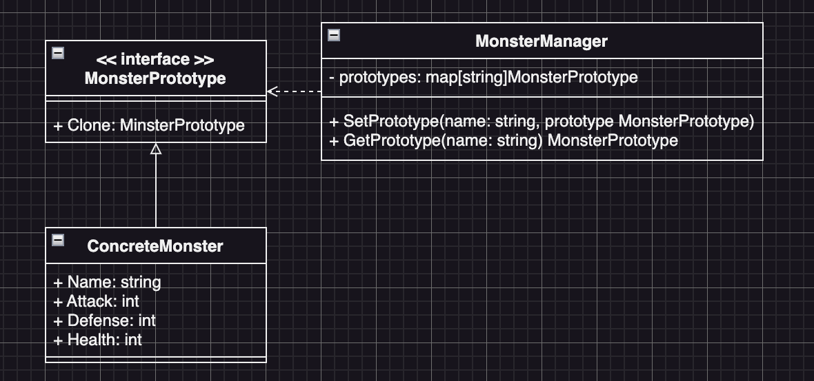

# Prototype Example1 (原型模式範例1)

## Prototype Motivation (情境)
* 假設你正在開發一個遊戲，需要創建不同種類的怪物角色。每個怪物角色都有不同的名稱和能力屬性，例如攻擊力、防禦力和血量。
* 你需要使用原型模式來創建怪物角色，並實現以下要求：
  - 定義一個怪物原型介面，其中包含 Clone() 方法，用於複製怪物角色。
  - 實現具體的怪物原型類別，該類別擁有名稱和能力屬性，並實現 Clone() 方法來複製自身。
  - 實現一個怪物管理器類別，該類別用於存儲和管理不同種類的怪物角色原型。該類別應該提供一個方法來設置和獲取特定種類的怪物原型。
  - 在客戶端程式碼中，使用怪物管理器類別來創建不同種類的怪物角色。
    - 首先，從怪物管理器獲取一個特定種類的怪物原型
    - 然後使用該原型複製出多個怪物角色，並對它們進行一些修改和操作。

這個練習題目可以幫助學生理解原型模式的概念和實際應用。他們需要思考如何設計怪物原型介面、實現具體的怪物原型類別，以及如何使用怪物管理器類別來創建和修改怪物角色。同時，他們還需要注意複製過程中是否需要深層複製屬性，以及如何在客戶端程式碼中使用這些原型來創建新的怪物角色

## Factory Method Applicability (解決方案)
- 首先我們定義一個角色的介面，在這個介面裡面有一個方法「攻擊」，**Client端使用這個角色介面物件，來進行遊戲**。
- 接著定義一個角色產生器的介面，Client端可以透過這個產生器來拿到角色介面物件，**Client端程式碼並不需要知道實際拿到了哪一個職業實例，只需要知道這個角色有一個攻擊的方法**
- 接著實作每個角色的類別，並確保這些類別都實作了「職業介面」
- 然後為這些角色製做專屬於它們的工廠，**並確保這些工廠類別實作了「角色產生器」的介面**

## Factory Method Implementations/Simple Code
* role.go
  - 角色介面與實作
* rolecreator.go
  - 角色產生器介面與實作
* 測試
  - `go test -v .`