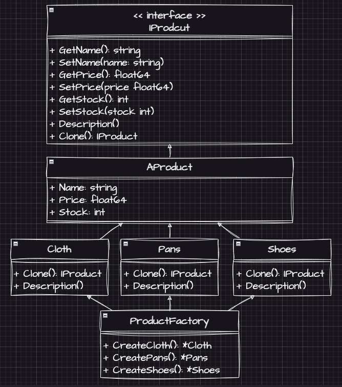

# Prototype Example1 (原型模式範例1)

## Prototype Motivation (情境)
* 你正在開發一個購物網站，其中有許多不同類型的商品，每個商品都有不同的屬性，如名稱、價格、庫存等。
* 請使用原型模式來實現一個商品工廠，它可以製造不同類型的商品，並且可以根據現有商品的原型製造一個新的商品，並進行修改。

## Prototype Applicability (解決方案)
* 我們假設有衣服、褲子以及鞋子三種商品
* 先定義一個商品介面IProduct，並定義各屬性的Setter跟Getter方法，以及一個Clone方法。
* 定義一個抽像類別AProduct，並實作IProduct介面的方法，讓各商品類別來繼承它，進一步減少需要重複實作的程式碼
* 接著定義各商品類別，並在繼承AProduct的同時，用複寫來實作各自的Clone方法與Description方法
* 最後定義一個商品工廠，來產生各種商品

## Prototype Implementations/Simple Code
* 測試
  - `go test -v .`