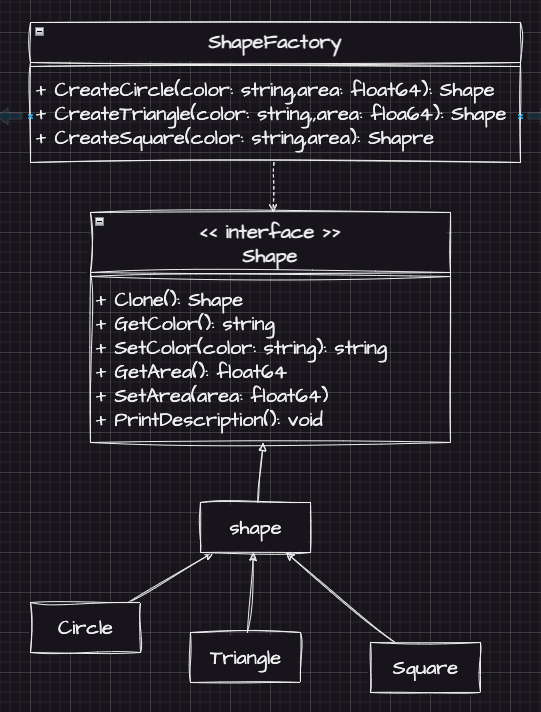

# Prototype Example2 (原型模式範例2)

## Prototype Motivation (情境)
* 你需要設計一個圖形工廠，它可以製作不同類型的圖形，如矩形、圓形、三角形等。
* 每個圖形都有不同的屬性，例如顏色、邊長、半徑等。
* 請使用原型模式來實現這個圖形工廠，以便可以複製已有的圖形並進行修改。

## Prototype Applicability (解決方案)
* 定義一個圖形的Shape介面，並包含各屬性的Setter跟Getter方法，以及一個Clone方法。
* 接著定義一個shape物件，在實作Shape介面方法的同時，也可以當作抽象物件(Abstract Object)來讓各個圖形物件繼承，進一步減少需要重複實作的程式碼
* 然後定義各個圖形物件，在繼承shape物件的同時，用複寫來實作各自的Clone方法與Description方法
* 最後定義一個圖形工廠，來產生各種圖形物件
* 每一個圖形物件都可以在Clone方法被複製以後，利用Setter來更改複本的屬性

## Prototype Implementations/Simple Code
* 測試
  - `go test -v .`